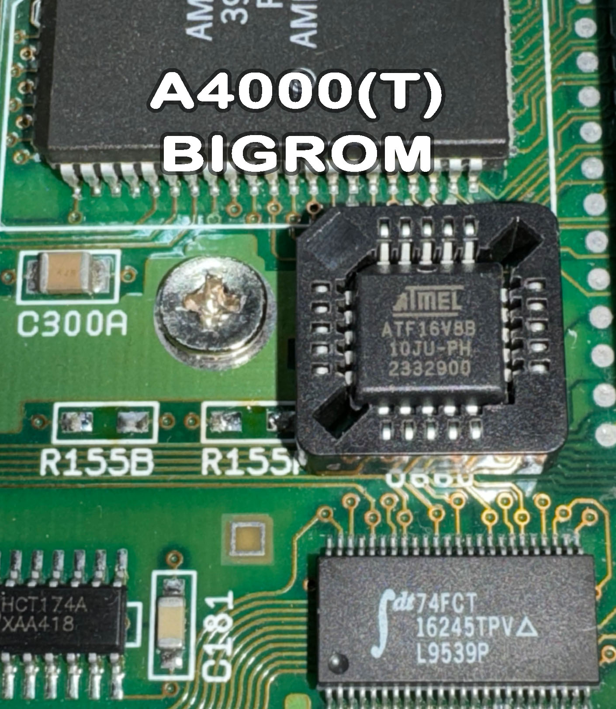

# A4000_BIGROM
>:red_circle:  **This project is still a work in progress as there ares only my test results available yet!**

The JED configuration in this project enables the 1MB Kickstart ROM option seen on A4000T computers and my modified A4000d version mainboards.
To make use of this option you need a GAL like the ATF16V8B-10 for the unpopulated component P155 (BIGROM).
Use the JED file in the logic folder to program this GAL.
Then you need to remove the 2 resistors R155A and R155B and solder a PLCC-20 socket onto the board.
